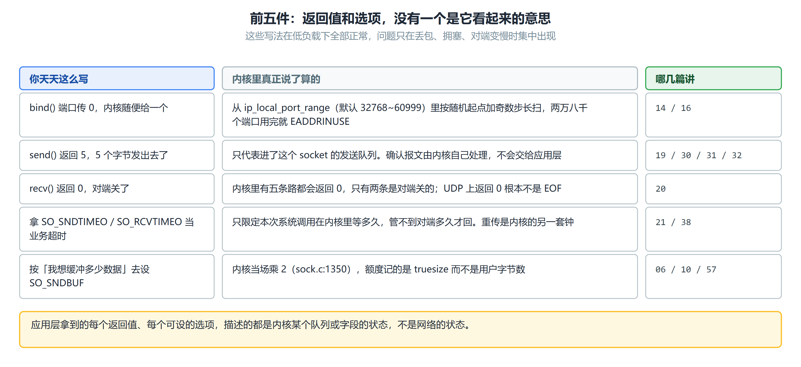
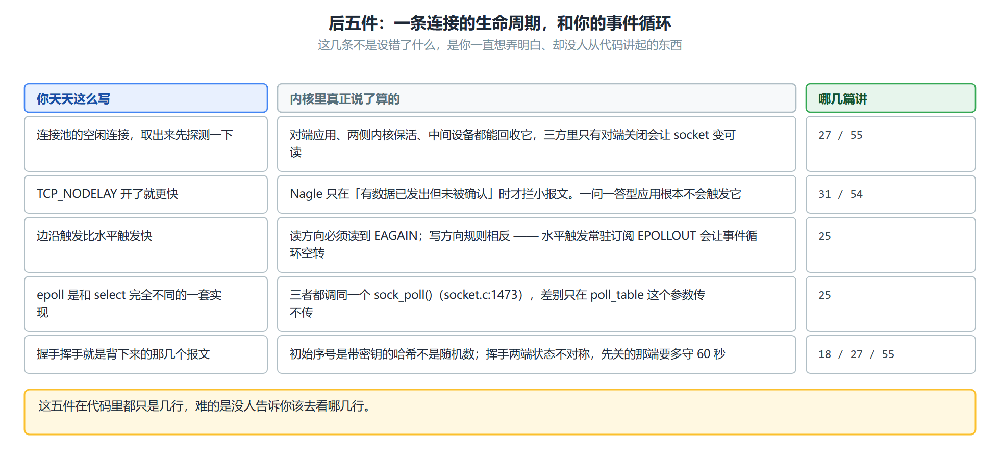
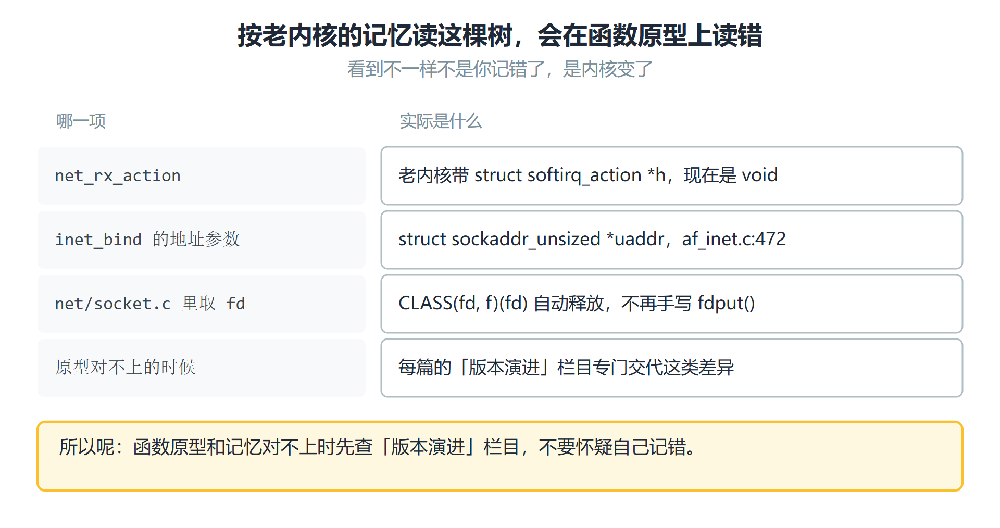
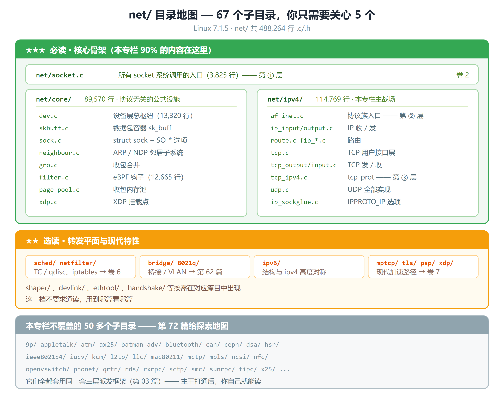
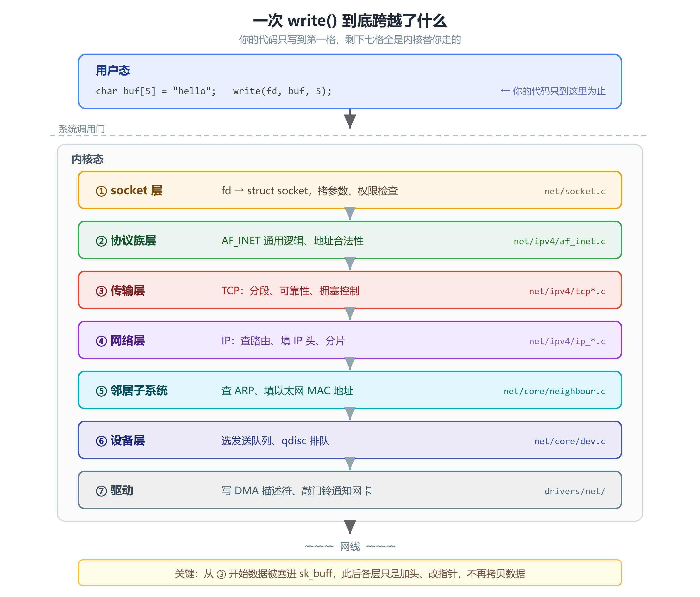
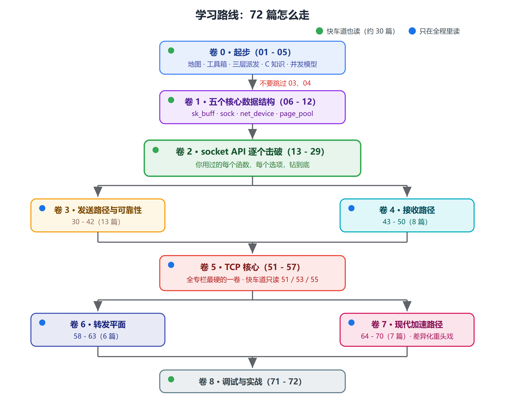
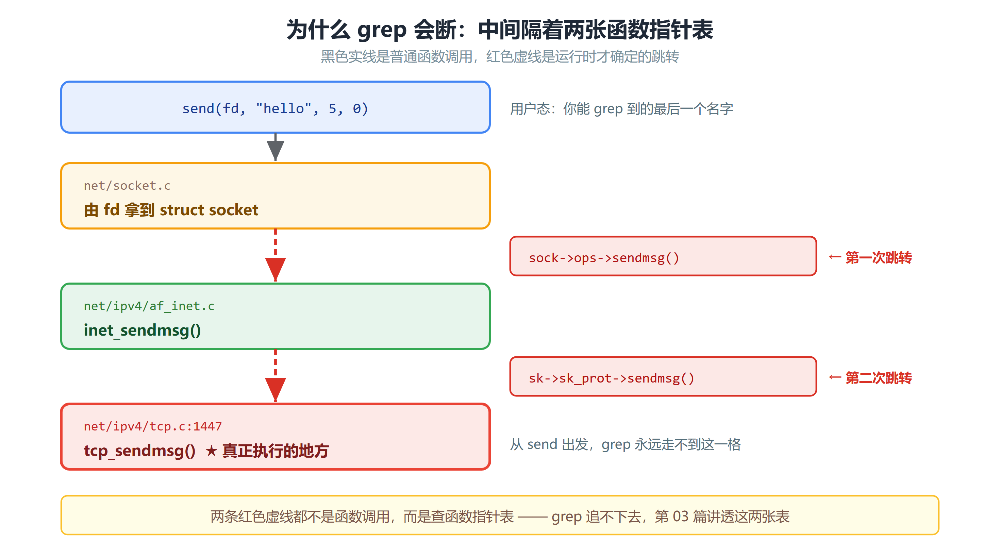

# 专栏：Linux网络编程从应用层到内核实现源码详解

> Linux 内核版本：**7.1.5**（代号 Baby Opossum Posse）　
>
> 源码：https://www.kernel.org/pub/linux/kernel/v7.x/

---

## 一、三行代码，三个你答不上来的问题

你一定写过这样的代码：

```c
int fd = socket(AF_INET, SOCK_STREAM, 0);
connect(fd, (struct sockaddr *)&addr, sizeof(addr));
write(fd, "hello", 5);
```

三行，五个字节。然后呢？

你可能知道"内核会把它封成 TCP 段、加上 IP 头、交给网卡"。但如果我追问：

- 这 5 个字节从用户态内存拷到内核态的哪个结构体里？拷了几次？
- 它是**立刻**发出去的，还是被压在某个队列里等待？等什么？
- 如果我在 `write()` 之前加一行 `setsockopt(fd, IPPROTO_TCP, TCP_NODELAY, &one, 4)`，
  内核里究竟哪一个变量的哪一个 bit 变了？后果是哪一行代码走了不同的分支？

**能不能答出这三个问题，是"用过网络"和"懂网络"的分界线。**

这个专栏就是要把这条线上的每一步，都落到源码的具体某一行。

---

## 二、十件事你天天在做，未必说得清

上一节那三个问题，答不上来并不丢人。真正值钱的是：**同一类问题，你每天还在遇到十几个**，
只是没意识到它们都指向同一处 —— 内核里某个具体的字段、某一行代码。

下面十件事，写过网络程序的人全都做过，多数是照着别人的代码抄的。
它们各自由内核里一个具体的事实决定，而那个事实通常和直觉相反。先看前五件：



### 2.1 `bind()` 端口传 0：内核不是"随便给一个"

`addr.sin_port = 0` 让内核自动挑一个端口，这是最常见的写法，也几乎从不出问题 —— 直到并发上去。

挑选范围是 `net.ipv4.ip_local_port_range`，默认 `32768 60999`，一共两万八千个。
挑法既不是顺序也不是纯随机，而是**随机起点加奇数步长**扫过去（第 14 篇有个实验能把这个规律直接打出来）——
所以你连着调两次 `bind(0)`，拿到的两个端口不会相邻。

对应用层的意思：并发连接逼近两万八千时 `bind()` 会开始返回 `EADDRINUSE`，
而这个上限是一个 sysctl，不是常量。另外 `bind(0)` 定端口和 `connect()` 时自动选端口
**走的不是同一条路**：后者按目的地址决定扫描起点，同一个目的地会接着上次的位置继续挑（第 16 篇）。

### 2.2 `send()` 返回了，数据还没上线路


`send(fd, buf, 5, 0)` 返回 5，读起来像"这 5 个字节已经发出去了"。
它的真实含义是：**这 5 个字节被拷进了该 socket 的发送队列**，内核接下了这份数据，仅此而已。
数据何时被组装成 TCP 段、何时真正交给网卡、对端何时确认，全都发生在这次返回之后
（第 19、30、31、32 篇分别讲这四步）。

这个差别决定了一件很具体的事：**重试逻辑不能建在 `send()` 的返回值上。**
`send()` 成功之后连接仍然可能断，而断的那一刻，那 5 个字节可能已经到达对端，
也可能还压在发送队列里 —— 应用层区分不了这两种情况，
因为**确认报文**（acknowledgement，缩写 ACK，对端用来告诉发送方"这些字节我收到了"的那个报文）
是内核自己处理掉的，不会交给你。
所以"发送成功即已送达"这个假设一旦写进业务代码，
就只能由更上层的机制（应用层回执、幂等键）来补，没有第三条路。

### 2.3 `recv()` 返回 0 有五条路，只有两条是"对端关了"

`if (n == 0) { /* 对端关闭 */ }` 这一行几乎人人写过。
第 20 篇把内核里所有能让 `recv()` 返回 0 的路径数了一遍：**一共五条，只有前两条是对端真的关了。**

`n < 0` 同样不能一概当错误。`EAGAIN` 是"现在没有数据"，`EINTR` 是"被信号打断了"，
两个都是正常路径 —— 非阻塞代码把它们当错误处理，会在完全正常的时候不停报错。

还有一条是 UDP 独有的：**UDP 上 `recv()` 返回 0 不是文件结束**，
它可能就是一个长度为 0 的数据报，而 UDP 本来就没有"连接关闭"这个概念。

### 2.4 超时有两套钟，你只能拧其中一套


`SO_SNDTIMEO` 和 `SO_RCVTIMEO` 听起来像"这次通信的超时时间"。
它们实际管的是**这次系统调用最多在内核里等多久**：
等发送队列腾出空间，或者等接收队列出现数据（第 21 篇）。
它们管不到"对端多久才回复"，因为对端回不回复，内核在这两个字段上看不出区别。

另一套钟在内核手里：数据发出去没收到确认，由重传定时器决定何时重发、重发几次、
间隔怎么退避（第 38 篇）。这套钟的节奏来自实测的往返时间，应用层设不了，也读不到。

结论是：**业务超时必须自己算，而且要设在比内核重传总时长更早的位置**，
否则内核还在安静地重传，你的调用方已经认为这次请求没有响应了。
第 38 篇会把重传总时长怎么估出来讲清楚。

### 2.5 `SO_SNDBUF` 设进去的数，内核当场乘 2


这是最容易被自己测出来、却最少被解释的一条。先把它测出来：

```c
int val = 64 * 1024, got = 0;
socklen_t len = sizeof(got);

setsockopt(fd, SOL_SOCKET, SO_SNDBUF, &val, sizeof(val));
getsockopt(fd, SOL_SOCKET, SO_SNDBUF, &got, &len);
printf("设进去 %d，读回来 %d\n", val, got);
```

**预期输出**：`设进去 65536，读回来 131072`。读回来的正好是设进去的两倍。
原因在 `sk_setsockopt()` 里 —— 所有 `SOL_SOCKET` 层的选项最后都落到这个函数，
第 22 篇会完整讲这条路。它处理 `SO_SNDBUF` 的正文只有一行：

```c
/* net/core/sock.c:1350 —— sk_setsockopt() 处理 SO_SNDBUF */
		WRITE_ONCE(sk->sk_sndbuf,
			   max_t(int, val * 2, SOCK_MIN_SNDBUF));
```

乘 2 是因为**这个上限管的不是用户数据的字节数，而是内存开销**：
每个待发送的报文除了你的数据，还带着 `struct sk_buff` 本身和对齐填充，
内核把这份总开销记在 `truesize` 里（第 06、10 篇）。
翻倍是给这部分开销留的余量，而余量够不够取决于你的报文有多大 ——
**发很多小报文的连接，64KB 的额度装不下 64KB 用户数据，可能只装得下不到十分之一**。

对应用层的意思是：这个值不该按"我想缓冲多少数据"去设。
接收方向更是如此，内核的自动调优（第 57 篇）通常比手工设的值更合适，
而**一旦调用 `setsockopt` 设过，自动调优就对这个 socket 停止工作了**。

后五件换一个角度：不是"你设错了什么"，而是**一条连接的生命周期和你的事件循环之间**，
那些你一直想弄明白、却没人从代码讲起的地方。



### 2.6 连接池里的空闲连接，有三方可以悄悄回收


长连接池最常见的故障是：一条连接放着没用，再拿出来用时第一个请求就失败。
能让这条连接在你不知情的时候消失的，有三方：

- **对端应用**主动关闭，你这一侧进入被动关闭流程，而这个状态变化在你调用之前不会通知你（第 27、55 篇）
- **两侧内核**的保活机制，默认要闲置两小时才开始探测，多数场景等不到它（第 55 篇）
- **中间设备**（网络地址转换设备、负载均衡器、防火墙）按自己的空闲超时删掉连接表项，
  而且删掉时往往不发任何通知，你只有下次发送时才会发现

三方里只有第一方会让你的 socket 变成可读。
所以连接池的正确做法不是"取出来先探测一下"，而是**空闲时长超过阈值就直接丢弃重建**，
阈值取所有中间设备空闲超时里最小的那个。第 55 篇讲完状态机之后，这个阈值怎么估会有具体依据。

### 2.7 `TCP_NODELAY` 不是"开了就更快"

这个选项在网上的说法高度一致地简化成了"打开就能降延迟"，它真实的作用条件要窄得多。

`TCP_NODELAY` 关掉的是 Nagle 算法，而 Nagle 只在**有数据已发出但还没被确认**时才拦截小报文。
真正让"请求—响应"型应用产生延迟的，是它和对端延迟确认机制的组合（第 31、54 篇）。
如果你的应用每次只发一个完整请求就等响应，Nagle 根本不会触发，打开这个选项没有任何效果。

### 2.8 边沿触发和水平触发：读和写的规则正好相反

这一条值得单独讲，因为**读方向和写方向的规则是反的**，而多数教程只讲了读那一半。

**读方向**：边沿触发只在"有新数据到达"那一刻报一次，所以你必须一直读到 `EAGAIN`。
少读一次，剩下的数据就再也等不到下一次通知。

**写方向反过来**：TCP 连接建好之后发送缓冲区通常是空的，`EPOLLOUT` **一直**处于就绪状态。
水平触发下如果常驻订阅它，`epoll_wait` 每次都立刻返回，事件循环空转、CPU 跑满 ——
第 25 篇把这个叫"最经典的一个 epoll bug"。水平触发在写方向的正确写法是**按需开关**：
`send()` 撞上 `EAGAIN` 才加上 `EPOLLOUT`，发完立刻去掉。
边沿触发在写方向反而可以常驻订阅而不空转，代价是同样必须写到 `EAGAIN` 为止。

所以"该用边沿还是水平"不是一句话能回答的问题：**同一个选择在读和写两个方向上的取舍不一样。**

### 2.9 `select` / `poll` / `epoll` 在内核里调的是同一个函数

三个接口看起来是三套东西，在内核里却只有一个交汇点：`sock_poll()`（`net/socket.c:1473`），
TCP 上它转手就调 `tcp_poll()`。**三个接口判断"就绪没有"用的是同一段代码。**

真正的差别在一个参数上 —— `poll_table *wait`。传非 `NULL` 的意思是
"顺便把我挂进这个 socket 的等待队列"，传 `NULL` 是"只告诉我状态，别挂"。

- `select` / `poll`：**每次调用**都传非 `NULL`，所有 fd 每次都要挂一遍、再摘一遍
- `epoll`：只在 `epoll_ctl(ADD)` 那一次挂上去，之后每次 `epoll_wait` 传的是清空过的，只查状态

"epoll 比 select 快"这句话，全部内容就是这一个参数的差别。第 25 篇有三者的完整代码对读。

### 2.10 三次握手和四次挥手，每一步落在哪一行

这两套流程你一定背过，但背下来的是**报文顺序**，不是内核里发生了什么。

握手那一侧：连接的第一个数字（初始序号）不是随机数，是一个带密钥的哈希 ——
客户端和服务端两条不同的入口，最后都落到同一个 `secure_tcp_seq_and_ts_off()`（`secure_seq.c:107`）。
服务端收到 SYN 的那一刻还没有 `socket`，只有一个轻量的 `request_sock`，
要等最后那个 ACK 到达才变成真正的连接（第 18 篇）。

挥手那一侧：**四个报文，两端的状态并不对称** —— 先关的那一端要多守 60 秒，
这就是 TIME_WAIT 只出现在一端的原因（第 18 篇）。
而你那句 `close(fd)` 到底发 FIN 还是发 RST，取决于接收队列里还有没有你没读走的数据（第 27 篇）。

---

**这十条的形状是同一个。** 应用层拿到的每一个返回值、每一个可设的选项，
描述的都是**内核某个队列或某个字段的状态**，而不是网络的状态。
把这两者当成一回事，写出来的代码在低负载下全部正常，
在丢包、拥塞、对端变慢的时候集中出问题 —— 这也是为什么这门课要从内核的数据结构讲起，
而不是从协议报文格式讲起。

---

## 三、读完这 72 篇，你能做到什么

上面那三个问题，答不上来一点都不丢人。写了多年网络程序的人，绝大多数也答不上来。
但它们能答上来之后，有四件事会跟着变。**先把这四件事摆在这儿**，
免得你读了半年才发现要的不是这个。

**第一，给你一个 socket 函数，你能自己追到它的内核实现，不用等人带路。**

这是新人最先撞上的一堵墙：`grep` 遍整个 `net/` 目录，
也找不到任何地方"调用"了 `tcp_sendmsg`。墙的另一边是函数指针表。
第 03 篇整篇在讲怎么翻过这堵墙。
另外还备了两张对照表作为后备——socket 函数 → 内核实现（第 03 篇附录）、
socket 选项 → 内核实现（第 22 篇附录，154 条），一时追不动就直接翻表。

**第二，线上出了现象，你知道该去读内核的哪一段。**

`ss -ti` 里 `retrans` 一直在涨、`cwnd` 掉到 2 就不肯回来、
一个报文在两台机器之间莫名其妙消失了。每个现象的背后，都是一段确定的代码。
第 32 到第 41 篇讲重传和拥塞窗口，把每一次变化都落到具体的某一行；
第 71 篇讲怎么让内核**亲口说出**它为什么丢包（内核里定死了 124 个丢包原因码）；
第 72 篇是一整篇排查实战，给你一个现象，一步步走到那段代码去。

**第三，调一个参数的时候，你知道自己改的是哪个字段。**

`TCP_NODELAY`、`SO_SNDBUF`、`net.ipv4.tcp_rmem`——
它们各自对应内核里一个具体字段，也各自在某一行上，改变了一个分支的走向。
第 22 篇讲一个选项从用户态到内核字段的全程；
第 23 篇讲选项、sysctl 和 cgroup 三者说法不一致的时候，最后谁说了算
（**cgroup** 是 control group 的缩写，中文叫控制组：
把一组进程圈在一起统一做资源限制，容器就建在它上面）。

**第四，你手上会有一套环境，能把问题造出来。**

第 02 篇把家伙什备齐：在一台机器上搭出多节点网络拓扑，
用 `tc` 造出丢包和延迟，用 `bpftrace` 把内核函数的实参打印在屏幕上。
之后每一篇都带【动手观测】，给的是能直接粘进终端跑的命令，以及它该输出什么。


**这个专栏不做的事**：它不是一本 TCP 协议教材。
RFC 里那套"当初为什么这么设计"，只在解释代码需要的时候顺带补一句，
重心始终是**这棵树上的代码究竟怎么写的**。
覆盖范围也有边界，只走 IPv4 加 TCP/UDP 主干，再加上现代加速路径，
蓝牙、WiFi、SCTP 都不碰——完整的范围声明在第四节。

## 四、这棵树长什么样，怎么弄到手

市面上的中文内核网络教程，绝大多数停在 **2.6.32 / 3.10 / 4.19**。
那些代码当然还能教会你 TCP 状态机，但今天线上机器跑的已经是另一套代码，**那部分它们教不了**。

先看这棵树的体量：

| 范围             | 规模                              | 内容                           |
| ---------------- | --------------------------------- | ------------------------------ |
| `net/` 整体      | 67 个子目录，488,264 行 `.c`/`.h` | 内核全部网络代码               |
| `net/core/`      | 89,570 行                         | 协议无关的公共骨架             |
| `net/ipv4/`      | 114,769 行                        | IPv4 + TCP + UDP + netfilter   |
| 其余 65 个子目录 | —                                 | 蓝牙 / WiFi / SCTP / MPTCP / … |

> 表里冒出来的名字**现在都不用记**，各给一句话就够：
> **netfilter** 是内核收发路径上预留的一组挂载点，`iptables` 这类工具把规则挂上去才生效（第 60 篇）；
> **MPTCP** 是 Multipath TCP，让一条连接同时走多条路径，比如手机上 WiFi 和蜂窝一起用（第 70 篇）。
> 文末附录的逐篇目录里，每一个都标了它在第几篇，到时候都会从零讲起。

单文件榜（这几个文件在后续各篇里会反复出现）：

| 文件                    | 行数   | 角色                                        |
| ----------------------- | ------ | ------------------------------------------- |
| `net/core/dev.c`        | 13,320 | 设备层总枢纽，收发两条路的交汇点            |
| `net/core/filter.c`     | 12,665 | eBPF 网络钩子的全部实现                     |
| `net/ipv4/tcp_input.c`  | 7,764  | TCP 接收与 ACK 处理，全内核最难啃的文件之一 |
| `net/core/skbuff.c`     | 7,522  | `sk_buff` 的全部操作                        |
| `net/ipv4/tcp.c`        | 5,386  | TCP 的用户态接口层                          |
| `net/ipv4/tcp_output.c` | 4,663  | TCP 发送                                    |
| `net/core/sock.c`       | 4,579  | `struct sock` 通用逻辑 + `SOL_SOCKET` 选项  |

> 📖 **表里第一个陌生词**：`net/core/filter.c` 那一行写的 **eBPF**，全称是
> extended Berkeley Packet Filter。它是这样一套机制：用户态往内核里注入一段小程序，
> 内核先验证这段程序不会越界、不会死循环，验证过了再让它在内核里跑。
> 没有它，你想让内核多做一点点事（数一类报文、丢一类报文、把报文转到别处），
> 就只能改内核源码再整个重新编译一遍。那 12,665 行就是这些小程序在网络栈里的全部挂载点。
> 第 65 篇专讲它；在那之前你只会看到它的名字，不需要会写。

> ⚠️ **新人预警**：看到 13,320 行的 `dev.c` 不要慌，也**千万不要**从它开始读。
> 本专栏的顺序是精心设计过的：先建立数据结构的心智模型（卷 1），
> 再顺着你熟悉的 socket 函数往下钻（卷 2），最后才碰这些大文件。

### 这棵树上有、而老教程里根本不存在的东西

| 特性                           | 在这棵树上的证据                                      | 讲解篇目                                              |
| ------------------------------ | ----------------------------------------------------- | ----------------------------------------------------- |
| **page_pool / netmem**         | `net/core/page_pool.c`                                | 第 46 篇（收包侧用法）、第 68 篇（netmem 抽象）       |
| **XDP**                        | `net/core/xdp.c`                                      | 第 64 篇                                              |
| **threaded NAPI**              | `net/core/dev.c:7889 napi_threaded_poll()`            | 第 45 篇                                              |
| **per-NAPI 配置**              | `dev->napi_config[]`，在 `dev.c:12115` 起的三行里分配 | 第 45 篇                                              |
| **BIG TCP**                    | `netdevice.h:2144 gso_max_size`（可 > 64KB）          | 第 67 篇                                              |
| **devmem TCP**（数据直落 GPU） | `net/core/devmem.c` + `SO_DEVMEM_DONTNEED`            | 第 68 篇                                              |
| **io_uring 零拷贝收包**        | `io_uring/zcrx.c`                                     | 第 69 篇                                              |
| **MPTCP**                      | `net/mptcp/`                                          | 第 70 篇                                              |
| **PSP 加密卸载**               | `net/psp/`                                            | 第 70 篇                                              |
| **netdev shaper**              | `net/shaper/`                                         | 本专栏不展开，第 61 篇讲 qdisc 时会说明它和 TC 的分工 |

> 📖 **这张表里的名词现在一个都不用懂** —— 右边那一列写着它们各自在第几篇讲。
> 只有 **XDP** 值得现在就交代一句，因为后面几篇会顺口提到它：
> XDP 是 **eXpress Data Path（快速数据路径）**，一个挂在网卡驱动收包最前端的钩子，
> 在内核还没为这个报文分配 `sk_buff` 之前就能决定丢掉它、改写它或者原路送回去。
> 没有它，哪怕只是想丢掉一个攻击报文，也得先付出"分配 skb + 走完设备层"的代价。第 64 篇细讲。

还有一些**细微但会绊倒老读者**的变化，本专栏会随处标注。举三个例子：

```c
// ① 软中断处理函数不再接收参数（老内核是 void net_rx_action(struct softirq_action *h)）
net/core/dev.c:7916    static __latent_entropy void net_rx_action(void)

// ② bind 的地址参数换成了 sockaddr_unsized
net/ipv4/af_inet.c:472 int inet_bind(struct socket *sock,
                                     struct sockaddr_unsized *uaddr, int addr_len)

// ③ fd 引用改用带自动释放的 CLASS 宏，不再手写 fdput()
net/socket.c:2231      CLASS(fd, f)(fd);
                       if (fd_empty(f))
                               return -EBADF;
```

如果你之前读过老内核，看到这些不要以为自己记错了——**是内核变了**。
每篇文章的「版本演进」栏目会专门交代这类差异。

（① 里的**软中断**（softirq）是内核里的一个执行上下文：硬件中断进来只记个账就返回，
真正的活推迟到"下半部"做，收发包的主流程全跑在这里。
第 05 篇会讲它怎么和你的进程抢同一个 socket。）



---

### `net/` 目录地图：67 个子目录，你只需要关心 5 个

上面列的那些文件散在 `net/` 下好几个子目录里，剩下六十来个装的是别的协议。**本专栏 90% 的内容只集中在下面这几个目录。**



> 💡 **范围声明**：本专栏只覆盖 **IPv4 + TCP/UDP 主干 + 现代加速路径**。
> 这不是偷懒——试图覆盖 67 个子目录是这类专栏最常见的失败方式。
> 把主干打通，其他协议你自己就能读了——它们全都套用同一套**三层派发**框架：
> 同一个 socket 函数具体落到哪段代码，是运行时查表决定的，而这套查表机制是共用的。
> 第 03 篇整篇在讲它。

---

### 把这棵树弄到手：三条命令

这门课的每一个结论都以这棵树为准，所以第一步是把它下下来。
全书出现的每一个 `文件:行号`，都能在你自己解压出来的这份代码里对上。

```bash
# 1. 下载。压缩报文是 xz 格式，解压后体积会大一个量级，留够磁盘
wget https://www.kernel.org/pub/linux/kernel/v7.x/linux-7.1.5.tar.xz

# 2. 解压并进去
tar xf linux-7.1.5.tar.xz
cd linux-7.1.5

# 3. 确认版本号 —— 这是唯一一步不能省的
head -5 Makefile
```

**预期输出**：

```text
# SPDX-License-Identifier: GPL-2.0
VERSION = 7
PATCHLEVEL = 1
SUBLEVEL = 5
EXTRAVERSION =
```

`VERSION` / `PATCHLEVEL` / `SUBLEVEL` 三个数拼起来就是 **7.1.5**。
对不上就说明下错了版本，**后面所有行号都会偏**。

> 💡 **同一目录下还有两个文件值得知道**：`linux-7.1.5.tar.sign` 是这份 tarball 的 GPG 签名，
> `sha256sums.asc` 是整个目录的校验和清单。要不要验签取决于你的场景 ——
> 但**版本号那一步必须做**，它挡的不是恶意篡改，是"我以为我下的是 7.1.5"。

不下载也能读完全书：正文引用的每一段代码都是**逐字贴出来的**，
并且有一道检查器保证每一行都能在树里原样找到（第 02 篇会讲这套工具）。
但只要你想自己 `grep` 一次、想验证书里某句话，就得有这棵树。

---

## 五、先看清楚地形：一次 `write()` 到底跨越了什么



**七层，每一层都在源码里有明确的对应文件。** 这个专栏的 72 篇文章，
就是把这张图的每一个方框拆开、逐行读完。

一个提前透露的关键事实：从 ③ 开始，你的数据就不再"是你的数据"了——
它被塞进了一个叫 **`sk_buff`** 的结构体，此后一路向下，各层只是在这个结构体上
**加头、改指针**，而**不再拷贝数据**。理解这一点，你就理解了内核网络栈一半的设计。
（`sk_buff` 是第 06、07 篇的主角。）

反方向的起点和这张图完全不同，值得先看一眼：报文到达时，网卡先靠**直接内存访问**
（Direct Memory Access，缩写 DMA —— 网卡不经过 CPU，自己把数据写进内存里一段事先备好的区域）
把报文放进内存，然后发一次**硬中断**通知内核。硬中断是网卡向 CPU 发出的中断请求，
它只记个账就返回，真正的收包工作推给随后的软中断去做。
这条路上的每一步由卷 4（第 43 ~ 第 50 篇）逐篇讲，硬中断与软中断的分工在第 05 篇。

---

## 六、九卷概览与两条轨道



### 这 72 篇分成九卷，各讲什么

上面那张图给的是顺序，这里给的是内容。
**九卷不是按内核的目录切的，是按一个报文的旅程切的**：先备好工具和名词，
再从 `socket()` 一路走到网线，然后掉头走回来，最后拐进转发和加速这两块。

| 卷                  | 篇号  | 这一卷回答什么               | 读完你能做什么                        |
| ------------------- | ----- | ---------------------------- | ------------------------------------- |
| 卷 0 · 起步         | 01~05 | 内核代码之间到底怎么连起来   | 自己找到任一 socket 函数的内核实现    |
| 卷 1 · 数据结构     | 06~12 | 五个结构体各装了什么         | 读懂任意一段 `net/` 代码里的名词      |
| 卷 2 · socket API   | 13~29 | 每个 API 落到哪一段代码      | 把用户态的行为对到内核字段上          |
| 卷 3 · 发送与可靠性 | 30~42 | 数据怎么出去，丢了怎么补     | 解释 `retrans` 和 `cwnd` 的每一次变化 |
| 卷 4 · 接收路径     | 43~50 | 报文从网卡怎么爬到 socket    | 定位收包方向的丢包和延迟              |
| 卷 5 · TCP 核心     | 51~57 | 状态机、ACK、窗口怎么联动    | 读懂一次抓包里每个报文的动机          |
| 卷 6 · 转发平面     | 58~63 | 路由、防火墙、限速、桥接     | 说清一个报文在主机里的完整走向        |
| 卷 7 · 现代加速     | 64~70 | 老教程里根本不存在的那些机制 | 判断一项新技术值不值得上              |
| 卷 8 · 调试实战     | 71~72 | 出了问题怎么一步步查         | 独立排一次线上网络问题                |

**逐篇的题目在文末附录**，九卷 72 篇一篇一行，现在扫一眼就行。

### 两条轨道，按你的目标选

知道了都讲什么，接下来是**读多少**。

|               | 🟢 快车道（约 30 篇）         | 🔵 全程（72 篇）              |
| ------------- | ---------------------------- | ---------------------------- |
| 目标          | 看懂 tcpdump、会调优、能排障 | 改内核、写驱动、做网络中间件 |
| 卷 5 TCP 核心 | 只读 51、53、55              | 全读                         |
| 卷 7 加速路径 | 只读 64                      | 全读                         |
| 预计投入      | 每周 1 小时 × 半年           | 每周 3 小时 × 一年           |

每篇文章标题下方都有难度标记，🟢 的篇目会刻意避开锁、RCU、内存屏障这些细节。

（这两个词现在不用懂，但先各知道一句。**RCU**（Read-Copy-Update）是一种同步办法，
它的特点是读方几乎不花开销：读者不加锁，写者也不原地改，
而是复制一份、改好、换指针，等旧读者全走光了再回收旧的那份。
路由表、协议注册表这类结构每秒被读几百万次、几天才改一次，
没有 RCU，光是加解锁本身就能把它们拖垮。
**内存屏障**（memory barrier）是一条告诉 CPU 和编译器"别把我前后的内存访问对调顺序"的指令；
没有它，一个 CPU 刚把对象写好，另一个 CPU 看过去可能还是个只填了一半的半成品。
第 04 篇第六节会把 RCU 讲透，内存屏障就出现在那一节的 `rcu_dereference()` 里。）

---

## 七、阅读方法：先记住这一件事

第三节提到的那堵墙，具体就是这个问题：

> 我在用户态调了 `send()`，我 `grep` 了整个 `net/` 目录，
> 为什么找不到任何地方"调用" `tcp_sendmsg`？

因为内核不是这么连起来的。中间隔着**函数指针表**：



**两次跳转，两张表。**

**第 03 篇**会把这两张表彻底讲透——它是整个专栏的地基，
讲完之后你**自己就能顺藤摸瓜找到任何 socket 函数的内核实现**，不再需要靠猜。

但在那之前先隔一篇。**下一篇是工具篇**：本专栏是要你动手的，
下面第八节马上就有第一个实验，而它十有八九不会一次跑通。
第 02 篇把家伙什备齐——查源码的 `grep` 该怎么问、`bpftrace` 装不上怎么办、
探针探不到该往哪查。备齐了再进正题，不然每篇的实验都会卡在同一批错误上。

---

## 八、动手：给你的第一个观测

不需要编译内核，只要机器上装了 `bpftrace` 就能跑（需要 root）。

脚本每一行都以 `kprobe:` 开头，先把这个词交代清楚，不然照着敲也是在抄咒语。

**`kprobe` 是内核的动态插桩机制。** 你给它一个内核函数名，内核就在那个函数的第一条指令上
临时换一条断点指令；此后每次有人调到这个函数，CPU 先跳去执行你挂的那段代码，再回来继续跑原函数。
**"动态"的意思是不改源码、不重新编译、不重启**——探针挂上去立刻生效，摘下来内核恢复原样。
它几乎能挂到任意一个内核函数上（`/proc/kallsyms` 里列出来的名字都可以试），
代价是内核函数名不算稳定接口：换一个内核版本，函数可能改名甚至消失，脚本就得跟着改。
本篇只是借 `kprobe` 看一眼三层跳转；它的完整用法，以及内核里和它并列的另一套观测机制，**第 02 篇**一起讲。


```bash
# 观察一次 curl 背后，内核网络栈的三层跳转
sudo bpftrace -e '
kprobe:__sys_connect      { printf("[1 系统调用层] %s\n", probe); }
kprobe:inet_stream_connect{ printf("[2 协议族层  ] %s\n", probe); }
kprobe:tcp_v4_connect     { printf("[3 协议层    ] %s\n", probe); }
' &

curl -s -o /dev/null http://example.com
```

预期输出：

```
[1 系统调用层] kprobe:__sys_connect
[2 协议族层  ] kprobe:inet_stream_connect
[3 协议层    ] kprobe:tcp_v4_connect
```

**这三行就是第 03 篇要讲的"三层派发"。** 你亲眼看到了它。

所谓派发，指的就是这种情形：**你写的是同一个 `connect()`，内核在运行时替你决定它该落到哪三个函数上。**
换成 UDP，第 2、3 行会变成完全不同的名字——第 03 篇会让你亲手验证这一点。

如果你的环境没有 `bpftrace`：

```bash
# Ubuntu / Debian
sudo apt install bpftrace
# CentOS / RHEL / Fedora
sudo dnf install bpftrace
```

完整的动手环境（编译内核、QEMU、虚拟网络）在第 02 篇搭建，
但**从现在开始，每一篇你都能跑起来**。

---

## 九、如果你只记住一件事

> **内核网络栈的所有跨层调用，都是通过函数指针表完成的。
> 学会看这些表，你就有了在 50 万行代码里导航的能力。**

---

## 十、思考题

1. `net/ipv4/` 和 `net/ipv6/` 的文件名高度对称（`tcp_ipv4.c` / `tcp_ipv6.c`、
   `ip_output.c` / `ip6_output.c`）。但 `net/ipv4/tcp_input.c` 有 7,764 行，
   `net/ipv6/` 下却**没有** `tcp_input.c`。为什么？
   （提示：TCP 的哪些逻辑与 IP 版本无关？）

2. 上面的 `bpftrace` 脚本对 `curl http://example.com` 有输出。
   如果把 URL 换成一个 UDP 服务（比如 `dig @8.8.8.8 example.com`），
   `kprobe:tcp_v4_connect` 还会触发吗？`kprobe:__sys_connect` 呢？
   先猜，再动手验证。

> 答案在第 03 篇末尾。下一篇是工具篇，不参与问答，隔一篇再接上。


---

## 附录 · 72 篇完整目录

下面是全部 72 篇的题目。里面有一批缩写，**现在一个都不用认得**——
每个缩写在它自己那一篇的开头都会从零讲一遍，这里只是让你先看见它们的位置。

先看一张总图：九卷、72 篇，中间一列是这一篇要回答的问题，最右一列是它的主角。
**这张图和上面第六节那张学习路线图分工不同** —— 那张回答"按什么顺序读"，这张回答"每一篇讲什么"。


[大型专栏：Linux网络编程从应用层到内核实现源码详解](https://mp.weixin.qq.com/s/gUfKdfRwwa8bxxtFJ8gXQw)

[第 02 篇 · 工具箱：读源码的工具，和看内核的工具](https://mp.weixin.qq.com/s/Df6u2vmd8DReAZOFk-xARg)

[第 03 篇 · 三层派发总纲：socket 函数如何找到它的内核实现](https://mp.weixin.qq.com/s/W2A3eAdv5K7jcKfZ8fQCCw)

[第 04 篇 · 读内核网络代码的最小 C 知识](https://mp.weixin.qq.com/s/JlfWcYkYNRSYdkKRttpTQg)

[第 05 篇 · 谁在和你抢同一个 socket：lock_sock() 到底锁了什么](https://mp.weixin.qq.com/s/9lRYWZpxTa_L1BD_eInE0w)

[第 06 篇 · sk_buff（上）：一块内存如何同时是帧、是包、是段](https://mp.weixin.qq.com/s/cekkTdLKkMONYowuXrC_Rg)

[第 07 篇 · sk_buff（下）：非线性区、克隆与引用计数](https://mp.weixin.qq.com/s/0w1sIBhQ3SJ6ZRJZwWBU2g)

[第 08 篇 · skb 的分配与回收：一个包的内存从哪来，又还到哪去](https://mp.weixin.qq.com/s/btKALhXKDZ5NpidnK0w_Rg)

[第 09 篇 · struct socket  与 struct sock：为什么一个连接要两个结构体](https://mp.weixin.qq.com/s/oT2hl1vlhNNZIFgx0t2rqA)

[第 10 篇 · sk 的队列与内存记账：SO_SNDBUF 到底限制了什么](https://mp.weixin.qq.com/s/BiiMGnFEW7R5vhSn5ExQyA)

[第 11 篇 · net_device 与多队列模型：网卡在内核里长什么样](https://mp.weixin.qq.com/s/0QSaYQ5V3w7XfbAz3BdDQQ)

[第 12 篇 · network namespace：struct net 为什么无处不在](https://mp.weixin.qq.com/s/PACx24yaUPi4JfK85MoDiQ)

[第 13 篇 ·  socket() ：一个 fd 的诞生](https://mp.weixin.qq.com/s/b8pDZF5Kn4eVGKxZ4CH2GQ)

[第 14 篇 · bind()：端口哈希表的秘密](https://mp.weixin.qq.com/s/rRSAc0fRdd0UNb0AszDugA)

[第 15 篇 · listen()：两个队列的真相](https://mp.weixin.qq.com/s/KENlMbXn7693mRf-IkDFTg)

[第 16 篇 · connect()：三次握手的发起端](https://mp.weixin.qq.com/s/-BYKo2QwNTZ-nh2sRVPnEw)

[第 17 篇 · accept()：从全连接队列取一个 sk](https://mp.weixin.qq.com/s/l9xMoG4t87Nc0tDbFNgUAw)

[第 18 篇 · 一次连接的完整生命周期：从第一个 SYN 到最后一个 FIN](https://mp.weixin.qq.com/s/yt3RKU13Ck0AKMfokvYzhg)

[第 19 篇 ·  send 家族：msghdr 与 iov_iter](https://mp.weixin.qq.com/s/yPZSPcERt0bS1RkfJZyDoA)

[第 20 篇 · recv 家族：从接收队列拷贝出来](https://mp.weixin.qq.com/s/Vpxp-gMzOS8NAQYULdY_GQ)

[第 21 篇 · 阻塞与非阻塞：同一段代码，只差一个 timeo](https://mp.weixin.qq.com/s/TihSS9LFnH4MsPWcAgEL8g)

[第 22 篇 · setsockopt 的一生：level 派发与 sockptr_t](https://mp.weixin.qq.com/s/d_Gs0Ou8Ei8QC75XBdzyTQ)

[第 23 篇 · 选项 vs sysctl vs cgroup：谁说了算](https://mp.weixin.qq.com/s/VE2DWH8g-swlTFipj5oc-g)

[第 24 篇 · cmsg：被忽略的另一半接口](https://mp.weixin.qq.com/s/kOPvVS8m_eb3hyPSkuxMWw)

[第 25 篇 · select/poll/epoll：唤醒链是怎么接起来的](https://mp.weixin.qq.com/s/5Li0shMZaJYM6L8BAz8U9g)

[第 26 篇 · epoll 内部：一棵红黑树、一条就绪链、一次 ep_poll()](https://mp.weixin.qq.com/s/R5r-AX-NTS5Pdq5R0LsgmQ)

[第 27 篇 · close() 与 shutdown()：语义差异的内核根源](https://mp.weixin.qq.com/s/sT_0OrA3_u3ycGhFUmaGHA)

[第 28 篇 · sendfile/splice/mmap：绕开用户态缓冲区](https://mp.weixin.qq.com/s/jRWE3ewhOQMwQVv12f7h1A)

[第 29 篇 · 同步与异步：SIGIO 那一代，和 io_uring 那一代](https://mp.weixin.qq.com/s/kEiANd5h7b6iN-6i5akuCQ)

[第 30 篇 · tcp_sendmsg_locked：用户数据如何变成 skb](https://mp.weixin.qq.com/s/A4LcfZRNOqW4iNt8Clj3Ww)

[第 31 篇 · tcp_push 与 Nagle：数据什么时候真的发出去](https://mp.weixin.qq.com/s/iG7WZDfO_xrEni9IvnWo8A)

[第 32 篇 · tcp_transmit_skb：TCP 头是怎么拼出来的](https://mp.weixin.qq.com/s/wh0UR7rtQtcfw3HU6JyOGQ)

[第 33 篇 · 八个标志位，各自由谁置上](https://mp.weixin.qq.com/s/URW8HnUfCrUSuYBxervhsQ)

[第 34 篇 · 滑动窗口：四个序号，两个窗口](https://mp.weixin.qq.com/s/7xfoVW20plft9muhg6JDeA)

[第 35 篇 · TSO / GSO：一个 skb 怎么变成多个报文](https://mp.weixin.qq.com/s/XBWJfRWsEoraDd7QG6-9qQ)

[第 36 篇 · ip_queue_xmit：路由查找与 IP 头组装](https://mp.weixin.qq.com/s/fSJsJ0EcsWe6QFvH6-w8ZA)

[第 37 篇 · 拥塞控制框架：tcp_congestion_ops 的回调表](https://mp.weixin.qq.com/s/ecC6qaD7-tMpsHJQavfNWQ)

[第 38 篇 · 重传定时器与 RTO：超时时间怎么算出来，超时之后做什么](https://mp.weixin.qq.com/s/QUjKesWtI_jHvrjMnALNQg)

[第 39 篇 · 快速重传与尾部丢包探测：不等 RTO 就判出丢包的两条路](https://mp.weixin.qq.com/s/rENVUJ4XQzdkLxGEKIJstg)

[第 40 篇 · RACK：按发送时间判定丢包](https://mp.weixin.qq.com/s/1pdUGBxuuU1wWjlZhAJhNw)

[第 41 篇 · undo：判错之后怎么撤销这次拥塞窗口下调](https://mp.weixin.qq.com/s/408UMlWyXUnkI7nQvBgq9g)

[第 42 篇 · 邻居子系统、ARP 与 __dev_queue_xmit](https://mp.weixin.qq.com/s/Y74AzQOjgPLJUlcHVyo5VA)

[第 43 篇 · 从硬中断到软中断：napi_schedule](https://mp.weixin.qq.com/s/vpokv_NPbzdqFmh0Qdkzzw)

[第 44 篇 · net_rx_action：软中断主循环与 budget](https://mp.weixin.qq.com/s/y-Jh5_tqyTmF5nfEvTwkzg)

[第 45 篇 · threaded NAPI、napi_config 与 busy_poll](https://mp.weixin.qq.com/s/_cESBpLEDaWynp9fxQfwOQ)

[第 46 篇 · 驱动 poll 内部：从 DMA 描述符环到 skb](https://mp.weixin.qq.com/s/-QZHfVnOW0sCyjWLNkd9Rw)

[第 47 篇 · GRO：把小报文粘成大报文](https://mp.weixin.qq.com/s/wQ4mpGzPjpOd_ixgBZbKjQ)

[第 48 篇 · __netif_receive_skb_core：packet_type 分发与 RPS/RFS](https://mp.weixin.qq.com/s/93DOT1Ijia2PXlMHucZpCA)

[第 49 篇 · ip_rcv到 ip_local_deliver：IP 层收包的三道关](https://mp.weixin.qq.com/s/0uwit_sixWjNOCGR_sK6bw)

[第 50 篇 ·tcp_v4_do_rcv：socket 查找、backlog 与 prequeue 的消亡](https://mp.weixin.qq.com/s/sxIxh-m1WqDDxuoIHvmt4Q)

[第 51 篇 · tcp_rcv_established：快速路径为什么快](https://mp.weixin.qq.com/s/kqnIP_OHhnDK3EkFahM7MA)

[第 52 篇 · tcp_ack 与 SACK 处理：收到一个 ACK，发送方更新哪些状态](https://mp.weixin.qq.com/s/3dtSjkOQ3Gv9NYHRcboj4Q)

[第 53 篇 · 乱序队列：一棵红黑树，进树、出树与内存不够时先丢谁](https://mp.weixin.qq.com/s/F5pCl2baHh2wDoKISapQ9w)

[第 54 篇 · 延迟 ACK、QUICKACK 与 ACK 压缩](https://mp.weixin.qq.com/s/KyWSnUtezX2pntpTA4ibdg)

[第 55 篇 · 状态机：握手、挥手、TIME_WAIT 与保活](https://mp.weixin.qq.com/s/JuKMHC8JZeGN3bn_gBfWHg)

[第 56 篇 · CUBIC 与 BBR 源码对读](https://mp.weixin.qq.com/s/MQlYVIaSFBIH31eNDUdbKg)

[第 57 篇 · 接收窗口与内存自动调优](https://mp.weixin.qq.com/s/Y0nKbm3gkIZ6hnOd1i8gng)

[第 58 篇 · 路由子系统与 dst_entry 的生命周期](https://mp.weixin.qq.com/s/8NYC8PM-3OoRPtRLwiZ_hQ)

[第 59 篇 · FIB trie、策略路由与 nexthop 对象](https://mp.weixin.qq.com/s/tXVcNnq9zPPBfTWth2BEYA)

[第 60 篇 · netfilter：hook 点如何嵌进收发路径](https://mp.weixin.qq.com/s/UEEEYigHIcbiXfknatPcKQ)

[第 61 篇 · TC 与 qdisc：pfifo_fast、fq、fq_codel](https://mp.weixin.qq.com/s/nocN_IkVl9B4DtTJDpn_ug)

[第 62 篇 · 桥接与 VLAN：帧进桥之后怎么查表转发，VLAN 标签在哪一步加减](https://mp.weixin.qq.com/s/MZ7IJaRrQsIXxn2Qh7pqXw)

[第 63 篇 · 隧道与封装：一个帧被 VXLAN 套上 50 字节，再原样拆开的全程](https://mp.weixin.qq.com/s/P_0Ewn74mU5LzQYOixsomw)

[第 64 篇 · XDP：在 skb 诞生之前拦截](https://mp.weixin.qq.com/s/ilFBP2johjzSiBqj8mbA7A)

[第 65 篇 · eBPF 网络钩子全景](https://mp.weixin.qq.com/s/a0PqGzAGKI46zeBE4jmffQ)

[第 66 篇 · 硬件卸载：NETIF_F_*如何改变代码路径](https://mp.weixin.qq.com/s/plm8Ec9l7oHt_bk5l5C6tw)

[第 67 篇 · BIG TCP：64KB 这道上限卡在哪，内核用什么办法绕过去](https://mp.weixin.qq.com/s/Ppsu5kuXNXf_nx9oVvlqFA)

[第 68 篇 · devmem TCP：数据直落 GPU 内存](https://mp.weixin.qq.com/s/Af7LJ0Etk_878IASItdiQg)

[第 69 篇 · io_uring 零拷贝收发](https://mp.weixin.qq.com/s/x04oOolIHbQdIX4ArXokKQ)

[第 70 篇 · MPTCP 与 PSP：新协议如何嵌进旧框架](https://mp.weixin.qq.com/s/MUGA4UQZTJIQVzH2OVq4DQ)

[第 71 篇 · dropreason 与观测工具箱：内核怎么给出丢包原因码，你又怎么读到它](https://mp.weixin.qq.com/s/9eSt9j3fhIJoAC8w8Pnblw)

[第 72 篇 · 性能排查实战：四个现场案例，以及怎么把这套方法用到你自己的内核上](https://mp.weixin.qq.com/s/mnZYNkfnxWs8UhWOy53Fog)


---

读完这 72 篇之后，还有一篇**[结语](https://mp.weixin.qq.com/s?__biz=MzI0NTE4NTE4Nw==&mid=2648802481&idx=1&sn=d14a47109da7a8c59a677d175ad15fd0&scene=21&poc_token=HPMrqWqjvPI4uJoM2Aa4Pc8XTdt2NYdJ32h7xOxI)**（`EPILOGUE.md`，不编号）。
它不讲新代码，只做一件前面没人做的事：**把 72 篇拆开学的东西装回一个整体** ——
一个字节完整往返途中的那些决定、七个贯穿全书的设计手法、
散在各篇里的关键数字和命名规律、这棵树和你机器上那棵的差别，
以及这个专栏没讲什么。
